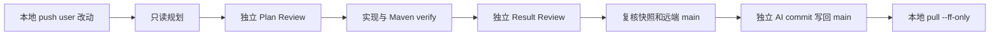

# 本地与 GitHub Actions 协作

本地由用户维护 `user` 包，GitHub Actions 在 push 后按最新明确契约适配实现、调用者、测试与文档。
这是 GitHub runner 上的 Codex CLI，不是当前 Codex 托管云环境，也不会同步本地未提交文件或复用托管环境的登录、网络和数据库配置。

## 启用

工作流位于 [.github/workflows/codex-user-implementation.yml](../../.github/workflows/codex-user-implementation.yml)。

1. 在仓库 **Settings → Secrets and variables → Actions → Secrets** 添加 `OPENAI_API_KEY`。不要把值发到聊天、提交到文件或复制 Codex 登录材料。官方 [Codex Action](https://github.com/openai/codex-action) 使用模型 API，API 用量单独计费；ChatGPT/Codex 订阅登录不能代替此密钥。
2. 确认仓库允许运行 GitHub Actions 和所引用的固定版本 Actions。可选设置 Actions **Variables** 中的 `CODEX_MODEL` 为账号可调用的模型；留空使用 Codex 默认模型。
3. 当前触发仅限 `main`。若组织策略或分支保护禁止 `GITHUB_TOKEN` 直接写回，`publish` 会失败；本流程不修改保护策略或改用高权限个人 token。

工作流写入仓库不等于真实模型链路已经验收。首次启用后在 Actions 查看各 job 和 artifacts；缺少 API key 时明确失败，不启动模型。可随时在 Actions 页面禁用该工作流。

## 日常开发

改接口时在 Javadoc、测试或根 `REQUIREMENTS.md` 明确行为、输入/输出、错误和验收。只改签名而未说明业务行为，可能只能迁移调用；不能期待 AI 自行决定事务、schema、权限或核心业务规则。

```powershell
git pull --ff-only
# 在本地修改 user 包，并同步本次明确需求。
git add src/main/java/com/kk24426/zbagentwf/user
# 如修改了需求/测试，逐项 git add 对应文件，避免夹带配置和秘密。
git commit -m "feat: define the next user contract"
git push origin main
```

每次 `main` push 包含 `src/main/java/com/kk24426/zbagentwf/user/**` 的改动才自动触发；只改需求或测试不会单独触发，其它分支也不会。
运行中的 job 不被新 push 取消，GitHub concurrency 可能替换尚未开始的排队任务。
因此任务读取从上次成功自动实现提交到当前源提交的 **累计 user 净差异**；首次以工作流引入提交为锚点。最新契约已删除的中间方法不会逐个实现。
尚未实现的既有历史接口不会因安装工作流全部自动落地，需要手动指定对应基准和明确需求。

流程为：



四次模型调用分别在独立 runner 上执行；只有实现步骤允许写工作区。评审结果通过 JSON 强制核验：Plan Accept/Can Implement、Result Accept/Can Commit/Push、无 P0/P1，且 Result 绑定完整 staged 补丁。
宿主使用 Java 26、仓库 Maven Wrapper，预取依赖后执行实现，再运行 `./mvnw -B clean verify`；先清除 target，避免模型生成的旧产物参与验收。MySQL 专用环境验收未启用，不做真实业务模型调用或部署。

自动候选路径仅限 `agent`/`common` 的 Java、`src/test`、`docs/contracts`、`docs/code-map` 和根需求台账的必要同步；这只是外层路径限制，仍须通过根规则的业务权限审核。
`user`、全部 AGENTS、治理 skills、自动化、构建及生产配置/资源/schema 不允许自动候选修改。
合法职责中的 rename/delete 会进入完整快照；链接、子模块、二进制和常见秘密形态会阻断，不静默剔除违规文件。模型开始前核对忽略输入基线；隔离 checkout 不接受 target 以外的本地忽略输入，后续新增/修改忽略配置也阻断，不能借 `.gitignore` 绕过审核或依赖不能重建的配置。构建产物中的链接也禁止。敏感信息扫描是启发式，不保证识别所有秘密，用户公开仓库资产检查仍必须完成。
实现模型不能 stage/commit/push；只有最后一个无模型、无 API key 的 job 使用 `contents: write`。

成功回推的提交消息为 `feat: implement user changes with Codex`，携带 `Codex-Source` 原用户 SHA；用户提交和 AI 实现分开。
工作流以源 SHA checkout，再重建同一 staged tree、补丁 SHA-256/Git hash-object、文件清单及状态，验证日志也参与绑定。普通 push 不 force、不 rebase、不自动 merge 或创建 PR。
回推使用 `GITHUB_TOKEN`，不会递归触发 push 工作流；候选也不能改 user，避免循环触发。

完成后先保存本地尚未提交的工作，再取回实现：

```powershell
git pull --ff-only
.\mvnw.cmd verify
```

不要在尚未提交的本地修改上自动应用云端补丁。远端变动导致 pull 无法快进时由用户决定如何处理，自动流程不改写本地或远端历史。

## 停止、恢复与材料

需求不明、Plan/Result 拒绝、实现 blocked、构建失败、越权路径、疑似敏感信息或远端已前进时均停止。每阶段本次仅一轮；没有隐式重试或自动扩大权限。没有改动则明确 no_change，不制造空提交。
回推前 `main` 必须仍是触发 SHA；执行期间用户又 push 时旧任务停止，最新任务读取累计差异。最后检查与 push 间的竞争由普通 fast-forward push 拒绝保护。

Actions artifacts 保留 7 天，按运行 ID 分别保存规划、计划评审、候选和结果评审材料；包含用户净 diff、计划、模型结论、审核 JSON、验证日志及最终快照。它们遵循仓库的访问权限，不能作为永久审核档案。
接口不足时从这些材料读取影响和备选方案，由用户改契约/需求后再次 push。构建/审核失败时 artifact 可能不含可提交补丁；不能将失败日志描述为成功结果。

也可在 Actions → **Codex user 包自动实现** → **Run workflow** 选择 `main`，输入 `base_sha`（累计差异起点的完整 40 位祖先提交 SHA）。这会对运行时最新 main 创建新任务；用于已有接口、外部配置修复或明确范围后重试。基准与当前 source 无 user 净差异时拒绝启动模型。
不要重新运行一个已过期源 SHA 的旧任务来覆盖新提交；它仍会被远端检查阻断。

## 自动化自身验证

```bash
python3 -m unittest discover -s .github/tests -v
```

这些测试使用隔离本地 Git/bare 仓库验证权限拒绝、rename/delete、symlink/gitlink、敏感/二进制阻断、审核类型/拒绝、快照/验证日志绑定、无空提交、累计水位与远端前进。它们不调用真实模型或 GitHub 服务，不代表真实 Actions API 授权、模型可用性或最终云端运行验收。
